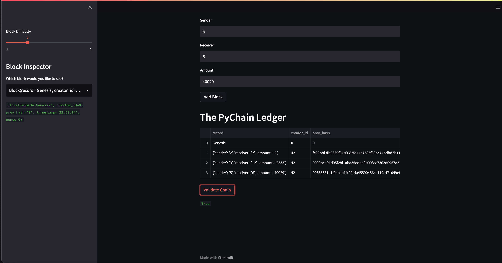

# pychain_ledger
A blockchain-based ledger system with a web interface.  The ledger allows banks to perform financial transactions and verify the integrity of the data within.

The user can enter their own id as well as the id of the recipient, and how many units they wish to send.  There is a block inspector to check the block contents and hashes, as well as a validation of the blockchain.

### Block Inspector

### Blockchain Validation
